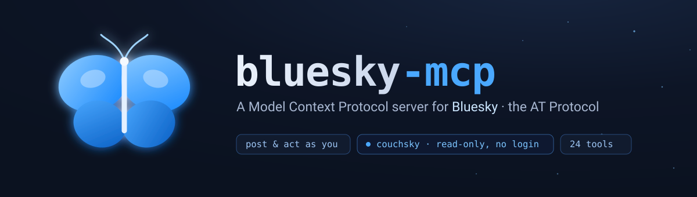

<p align="center">
  
</p>

# 🦋 bluesky-mcp

A [Model Context Protocol](https://modelcontextprotocol.io) server for **Bluesky** /
the **AT Protocol** — give any MCP-capable agent (Claude, etc.) the ability to post,
read, and browse Bluesky.

**Two access modes, one server:**

- **Account tools** (`bluesky_*`) act as *your* logged-in account — post, reply, like,
  repost, follow, and read your timeline + notifications. Needs an app password.
- **couchsky tools** (`couchsky_*`) are **public, read-only, no login** — read any
  profile, feed, or thread through the public AppView. The read-only
  "[Couch Sky](https://couchsky.app)" way; needs no credentials.

24 tools · TypeScript · stdio transport · MIT.

## Install

```bash
git clone https://github.com/8b-is/bluesky-mcp.git
cd bluesky-mcp
npm install
npm run build
```

## Configure (only for the account tools)

Copy `.env.example` to `.env` and fill in an **app password**
(Bluesky → Settings → App Passwords — *never* your main password):

```ini
BLUESKY_IDENTIFIER="your-handle.bsky.social"
BLUESKY_APP_PASSWORD="xxxx-xxxx-xxxx-xxxx"
```

The server loads `.env` from its own directory, so it works no matter where your
client launches it. The `couchsky_*` read tools need none of this.

## Connect an MCP client

Point your client at the built server (Claude Code, Claude Desktop, etc.):

```json
{
  "mcpServers": {
    "bluesky": {
      "command": "node",
      "args": ["/absolute/path/to/bluesky-mcp/dist/index.js"]
    }
  }
}
```

Prefer passing secrets through the client? Add an `"env": { "BLUESKY_IDENTIFIER": "…",
"BLUESKY_APP_PASSWORD": "…" }` block instead of a `.env`. Restart the client to load it.

## Tools

**Post & act — as you**
`bluesky_post` · `bluesky_reply` · `bluesky_like` · `bluesky_repost` · `bluesky_follow` · `bluesky_delete_post`

**Read — your account**
`bluesky_whoami` · `bluesky_timeline` · `bluesky_notifications` · `bluesky_notification_count` · `bluesky_get_post` · `bluesky_get_thread` · `bluesky_get_author_feed` · `bluesky_get_likes` · `bluesky_get_profile` · `bluesky_search` · `bluesky_search_actors` · `bluesky_get_followers` · `bluesky_get_follows` · `bluesky_resolve_handle`

**couchsky — public, read-only, no login**
`couchsky_profile` · `couchsky_author_feed` · `couchsky_thread` · `couchsky_search`

The agent-facing guide — when to use which, and posting etiquette — is in
[AGENTS.md](AGENTS.md).

## Develop

```bash
npm run dev      # tsx, live source
npm run build    # tsc → dist/
```

## License

MIT © Peter Lodri · 🜂 *ahogy a dolgok vannak*
